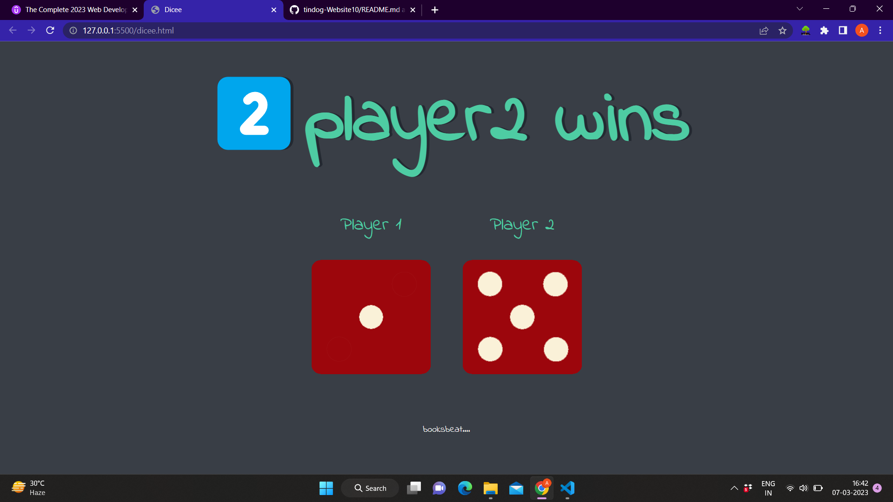

#  Dice Game....

Making a simple but fun Dice game:D.

## Table of contents

- [Overview](#overview)
  - [About Dicegame](#about-tindog)
  - [Screenshot](#screenshot)
  - [Links](#links)
- [My process](#my-process)
  - [Built with](#built-with)
  - [Continued development](#continued-development)
  - [Useful resources](#useful-resources)
- [Author](#author)
- [Acknowledgments](#acknowledgments)

## Overview

### About Dicegame

Dice-game is a simple but fun game which can be played between two players where the one with more dice points will win...... it's really helpful for your tosses.....:->

### Screenshot

### Links

- Live Site URL: [Github Pages]()

## My process

### Built with

- HTML5
- CSS custom properties
- Flexbox
- CSS Grid
- Javascript

### Continued development

I want to learn more about "CSS Grid" and "javascript" and also want to learn more about "jquery" and "Refracting a code".

## Author

- Github Profile Link - [aniket6508](https://github.com/aniket6508)
- Linkdin - [@aniket-kumar](https://www.linkedin.com/in/aniket-kumar-62a177224/)
- Instagram - [@_anti.social_10](https://www.instragram.com/_anti.social_10 )

## Acknowledgments

I would liked to thank Dr. Angela Yu for her guidance and support in web development bootcamp. Because of her I was able to learn the web development.

Thanks for reading this far, if you have any suggestions or feedback, please let me know in the comments below. I would love to hear from you.
